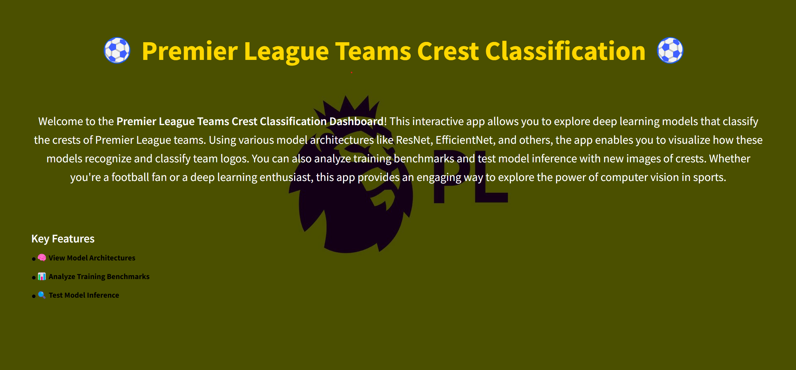
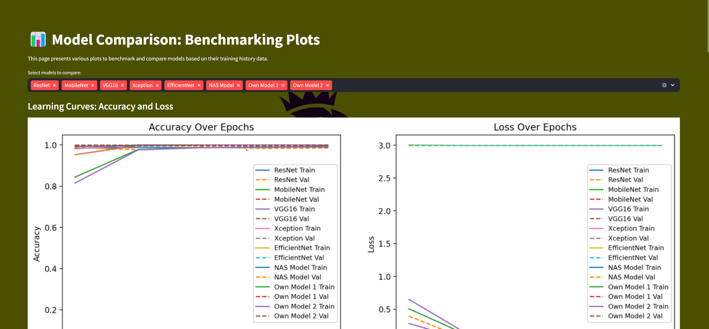
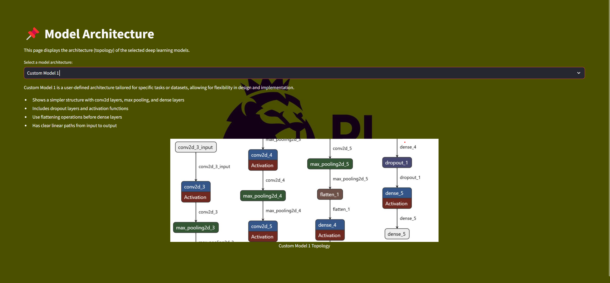
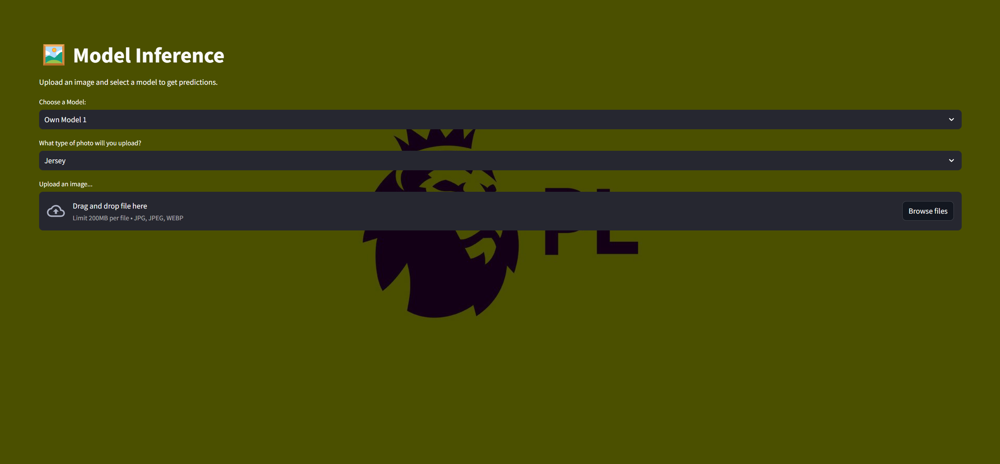

# Premier League Team Identifier: Logo and Jersey Analysis

The Premier League Team Identifier is a web application built using Streamlit that allows users to upload images of Premier League(Footall) team logos and jerseys. The application utilizes advanced machine learning models to identify and classify the uploaded images into their respective teams. This project aims to provide an interactive tool for sports enthusiasts, researchers, and developers interested in image classification and sports analytics.

## Installation

1. Clone the repository:
   ```bash
   git clone https://github.com/Siddhant-13/PremierLeague-Team-Identifier.git
   cd PremierLeague-Team-Identifier

## Features

* **Model Selection:** Choose from various pre-trained models (e.g., ResNet, MobileNet, VGG16, InceptionV3, Xception, EfficientNet) or custom models for classification.

* **Image Upload:** Easily upload images in formats such as JPG, PNG, JPEG, and WEBP.

* **Real-Time Predictions:** Get instant predictions on the uploaded images with visual feedback.

* **Logo and Jersey Classification:** Classify images as either logos or jerseys of different sports teams.

* **User-Friendly Interface:** A simple and intuitive web interface built with Streamlit.

## Application Screenshots

### 1. Home Page

The **Home Page** serves as the main entry point of the application. It provides an overview of the functionalities available and allows users to navigate to different sections of the app.
<br>

### 2. Benchmarks of All Models

The **Benchmarks Page** presents a comparative analysis of all available models. Users can view performance metrics such as accuracy, precision, and recall for each model, helping them understand which model performs best for their specific use case.
<br>

### 3. Model Architectures of All Models

This page displays the architecture diagrams for each model implemented in the application. Users can explore the design and structure of various models like ResNet, MobileNet, and more, providing insights into how each model processes input data.
<br>

### 4. Inference Page

The **Inference Page** allows users to upload images and get real-time predictions based on the selected model. After uploading an image, users can see the predicted class.

## Data
The data used to train the models for this application was sourced from [here](https://www.kaggle.com/datasets/alexteboul/english-premier-league-logo-detection-20k-images?utm_source=chatgpt.com). This dataset includes a diverse collection of images categorized by team, providing the necessary information for accurate model training and evaluation.

## Model Files
Due to their large size, the pre-trained model files have not been included in this repository. However, you can easily generate your own models by utilizing the provided training scripts and architecture definitions. The code contains all the necessary components to recreate the models detailed in this project.


## License

This project is licensed under the MIT License - see the [LICENSE.md](LICENSE.md) file for details.
